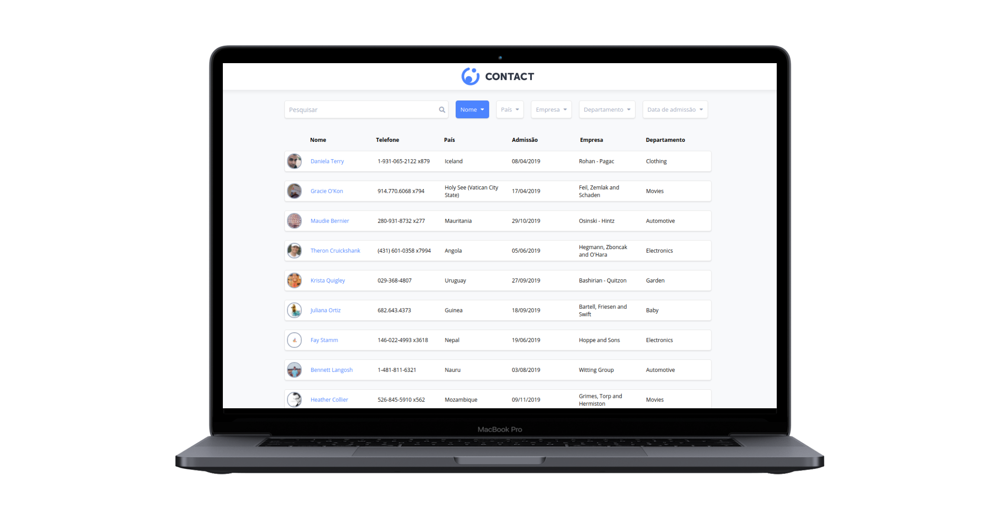

# SPA: App de Contatos - PARTE 1

## Objetivo:
O desafio é desenvolver um *SPA (Single Page Application)* de uma lista de contatos em **React** com as seguintes funcionalidades:

-  Consumir os dados de contato através de uma API Rest, usando a *Fetch API* do Javascript.
-  Busca de um contato aplicando filtro em **tempo real**.
-  Aplicar filtros de ordenação por *Nome*, *País*, *Empresa*, *Departamento* e *Data de Admissão*.

### Requisitos - Parte 1:

- Modularize os componentes na pasta components.
- Atualize os arquivos de componentes carregando corretamente seus estilos e suas marcações JSX.

### Iniciar o projeto:

- Instale as dependências do projeto com o comando *yarn install* ou *npm install*.
- Inicie o projeto com comando *yarn start* ou *npm start* / *npm run start*.
- Para realizar os teste  *yarn test*  ou *npm run test*

**Preview:**

	

