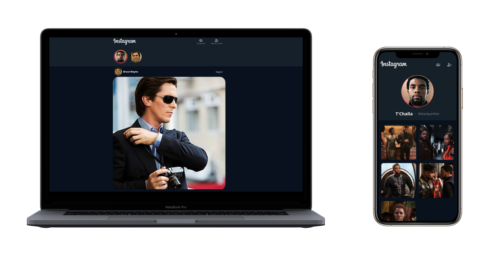

# Instadev React SPA (Parte 2)

## Objetivo:
O desafio desta semana e da próxima será desenvolver um *SPA (Single Page Application)* mobile-first do **Instagram** em React.

## Requisitos Parte 2:
Nesta segunda parte você deverá trazer o que foi implementado na parte 1 e cuidar dos estados dos componentes, das requsições HTTP de cada Rota da aplicação e dos ciclos de vida dos componentes utilizando React Hooks e abordagem funcional, os seguintes requisitos devem ser cumpridos:

> * Ser desenvolvido utilizando abordagem funcional e React Hooks para gerenciamento de ciclo de vida e estados.
> * Consumir os dados da Rest API, usando o [Fetch API](https://developer.mozilla.org/pt-BR/docs/Web/API/Fetch_API/Using_Fetch) do Javascript.
> * Exibir os **posts** de todos os usuários na rota inicial */*. 
> * Exibir todos os **usuários** cadastrados na rota */users*
> * Exibir o perfil do **usuário** e seus respectivos **posts** na rota */users/{username}*
> * Exibir os **stories** dos **usuários** na rota inicial */*. 
> * Ao clicar no ícone de **story** do **usuário** deverá abrir seu story com o respectivo vídeo e barra de progresso com a opção de fechar e voltar para o feed (rota inicial).
> * Deve permitir cadastrar um usuário na rota */newuser* e exibir uma mensagem de alerta ao enviar.

### Estrutura de Arquivos e Pastas:
Como já aprendemos em aula, a organização das pastas e arquivos deverá utilizar os seguintes padrões:
* *presentational components* e *container components* -> [Referência](https://medium.com/@dan_abramov/smart-and-dumb-components-7ca2f9a7c7d0) 
* *Rails-Style Structure + Module Index* -> [Referência](https://webcache.googleusercontent.com/search?q=cache:DZ0HZwEl7AUJ:https://www.learnhowtoprogram.com/fidgetech-4-react/4-4-advanced-topics/4-4-3-3-react-and-redux-design-patterns+&cd=1&hl=en&ct=clnk&gl=br)

Seguindo estes dois padrões, a estrutura de arquivos e pastas do seu projeto deverá ficar exatamente assim (dentro de */src*:

    ├── assets
    │   └── img
    │       ├── instagram-glyph.png
    │       └── instagram-logo.svg
    ├── components
    │   ├── Loading
    │   │   ├── Loading.jsx
    │   │   ├── Loading.scss
    │   │   └── index.jsx
    │   ├── Post
    │   │   ├── Post.jsx
    │   │   ├── Post.scss
    │   │   └── index.jsx
    │   ├── Story
    │   │   ├── Story.jsx
    │   │   ├── Story.scss
    │   │   └── index.jsx
    │   ├── SuccessMessage
    │   │   ├── SuccessMessage.jsx
    │   │   ├── SuccessMessage.scss
    │   │   └── index.jsx
    │   ├── Topbar
    │   │   ├── Topbar.jsx
    │   │   ├── Topbar.scss
    │   │   └── index.jsx
    │   └── User
    │       ├── User.jsx
    │       └── index.jsx
    ├── containers
    │   ├── App
    │   │   ├── App.jsx
    │   │   ├── App.scss
    │   │   └── index.jsx
    │   ├── Posts
    │   │   ├── Posts.jsx
    │   │   └── index.jsx
    │   ├── Stories
    │   │   ├── Stories.jsx
    │   │   ├── Stories.scss
    │   │   └── index.jsx
    │   ├── UserForm
    │   │   ├── UserForm.jsx
    │   │   ├── UserForm.scss
    │   │   └── index.jsx
    │   ├── UserPosts
    │   │   ├── UserPosts.jsx
    │   │   ├── UserPosts.scss
    │   │   └── index.jsx
    │   ├── UserProfile
    │   │   ├── UserProfile.jsx
    │   │   ├── UserProfile.scss
    │   │   └── index.jsx
    │   └── UsersList
    │       ├── UsersList.jsx
    │       ├── UsersList.scss
    │       └── index.jsx
    ├── index.js
    ├── modules
    ├── routes
    │   ├── FeedRoute
    │   │   ├── FeedRoute.jsx
    │   │   ├── FeedRoute.scss
    │   │   └── index.jsx
    │   ├── NewUserRoute
    │   │   ├── NewUserRoute.jsx
    │   │   └── index.jsx
    │   ├── ProfileRoute
    │   │   ├── ProfileRoute.jsx
    │   │   └── index.jsx
    │   ├── UsersRoute
    │   │   ├── UsersRoute.jsx
    │   │   └── index.jsx
    │   └── index.jsx
    ├── serviceWorker.js
    └── setupTests.js

### Preview

	

