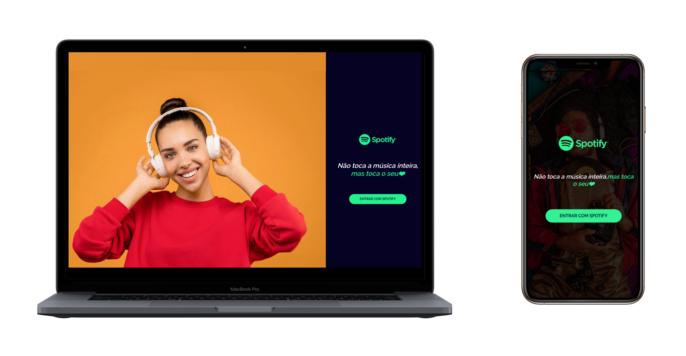

# React / Redux Spotify Pocket SPA

## Objetivo:
Neste último desafio você aplicará todo o conhecimento adquirido durante o curso e terá que desenvolver uma versão _**pocket**_ do Spotify, integrada a [Web API](https://developer.spotify.com/documentation/web-api) oficial, utilizando `fluxo implícito de concessão` (Implicit Grant Flow) para realizar a autenticação do usuário, permite que ele acesse rotas privadas dentro da aplicação.

## Tópicos:
Neste desafio você vai praticar os seus conhecimentos em:

* Fetch API
* JS Funcional: `Map`, `Filter`
* Modularização: `BEM` (Bloco, Elemento e Modificador)
* Presentational e Container Components
* Rails-Style Structure
* React Hooks, `useState`, `useEffect`, `useRef`
* React Testing Library
* React
* React Router Dom
* Rotas Privadas
* Redux: `ActionTypes`, `Action Creators`, `Reducers`, `Store`
* Redux Persist: `LocalStorage`


## Fluxo de autenticação
> Nesse projeto vamos utilizar o fluxo implícito de concessão é para `clientes` implementados inteiramente usando JavaScript e em execução no navegador do proprietário do recurso.
>
>
> Leia mais na seção `Implicit Grant Flow` em [https://developer.spotify.com/documentation/general/guides/authorization-guide](https://developer.spotify.com/documentation/general/guides/authorization-guide)


## Estrutura de arquivos e pastas
> A estrutura de pastas utilizada é conhecida como `Rails-Style Structure (function-first organization)` com um arquivo index por pasta de _feature_ levemente inspirada no [Destiny: Prettier for File Structures](https://github.com/benawad/destiny):

```bash
.
├── actions
│   ├── auth.js
│   ├── content.js
│   ├── index.js
│   └── user.js
├── assets
│   ├── icons
│   │   ├── spotify-icon-green.svg
│   │   └── spotify-icon-white.svg
│   ├── images
│   │   ├── app-intro-1.jpg
│   │   └── app-intro-2.jpg
│   └── logos
│       ├── spotify-logo-green.svg
│       └── spotify-logo-white.svg
├── components
│   ├── Loading
│   │   ├── Loading.jsx
│   │   └── Loading.scss
│   ├── Logo
│   │   └── Logo.jsx
│   ├── RouteHeader
│   │   ├── RouteHeader.jsx
│   │   └── RouteHeader.scss
│   ├── WelcomeBox
│   │   ├── WelcomeBox.jsx
│   │   └── WelcomeBox.scss
│   └── index.jsx
├── config
│   └── index.js
├── constants
│   ├── auth.js
│   ├── content.js
│   └── user.js
├── containers
│   ├── App
│   │   ├── App.jsx
│   │   └── App.scss
│   ├── Authorize
│   │   ├── Authorize.jsx
│   │   └── Authorize.scss
│   ├── Categories
│   │   ├── Categories.jsx
│   │   ├── Categories.scss
│   │   └── CategoryItem.jsx
│   ├── Dashboard
│   │   ├── Dashboard.jsx
│   │   └── Dashboard.scss
│   ├── Login
│   │   ├── Login.jsx
│   │   └── Login.scss
│   ├── Player
│   │   ├── Player.jsx
│   │   └── Player.scss
│   ├── Playlists
│   │   ├── PlaylistItem.jsx
│   │   ├── Playlists.jsx
│   │   └── Playlists.scss
│   ├── PrivateRoute
│   │   └── PrivateRoute.jsx
│   ├── Topbar
│   │   ├── Topbar.jsx
│   │   └── Topbar.scss
│   ├── Tracks
│   │   ├── Track.jsx
│   │   ├── Track.scss
│   │   ├── Tracks.jsx
│   │   └── Tracks.scss
│   └── index.jsx
├── index.js
├── modules
│   ├── custom-hooks.js
│   ├── endpoints.js
│   ├── helpers.js
│   ├── request.js
│   └── url.js
├── reducers
│   ├── app.js
│   ├── auth.js
│   ├── content.js
│   ├── index.js
│   └── user.js
├── routes
│   ├── AuthorizeRoute.jsx
│   ├── DashboardRoute.jsx
│   ├── LoginRoute.jsx
│   ├── PlaylistsRoute.jsx
│   ├── TracksRoute.jsx
│   └── index.jsx
├── serviceWorker.js
├── setupTests.js
├── store
│   └── index.js
└── styles
    ├── globalStyles.scss
    ├── normalize.scss
    └── reset.scss
```

## Preview 

<p  align="center">
	
</p>