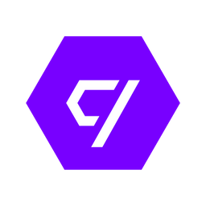

<h1  align="center">

</h1>
 
<h4  align="center">
	🤠 AceleraDev React
</h4>

  
## :telescope: Sobre
 
Repositório contendo projetos desenvolvidos durante o AceleraDev React Online.
  
  
## :books: Módulos

### [Módulo 1: Browser Engine, Motores e Debugging](https://github.com/Luuck4s/AceleraDev-React/tree/master/Modulo%201)

### [Módulo 2: HTML5 e CSS3, Atomic Design e CSS Modular](https://github.com/Luuck4s/AceleraDev-React/tree/master/Modulo%202)

### [Módulo 3: Javascript I, Fundamentos da Linguagem](https://github.com/Luuck4s/AceleraDev-React/tree/master/Modulo%203)

### [Módulo 4: Javascript II, Paradigmas e Testes](https://github.com/Luuck4s/AceleraDev-React/tree/master/Modulo%204)

### [Módulo 5: React I, Fundamentos e React OO](https://github.com/Luuck4s/AceleraDev-React/tree/master/Modulo%205)

### [Módulo 6: React II, Fundamentos e React OO](https://github.com/Luuck4s/AceleraDev-React/tree/master/Modulo%206)

### [Módulo 7: React Hooks, React Funcional](https://github.com/Luuck4s/AceleraDev-React/tree/master/Modulo%207)

### [Módulo 8: Redux, Gerenciamento de Estado](https://github.com/Luuck4s/AceleraDev-React/tree/master/Modulo%208)

### [Módulo 9: Redux, Build e Deploy](https://github.com/Luuck4s/AceleraDev-React/tree/master/Modulo%209)

--- 

<h5 align="center"> 🚀 AceleraDev React  by Luuck4s 💜 </h5>

---